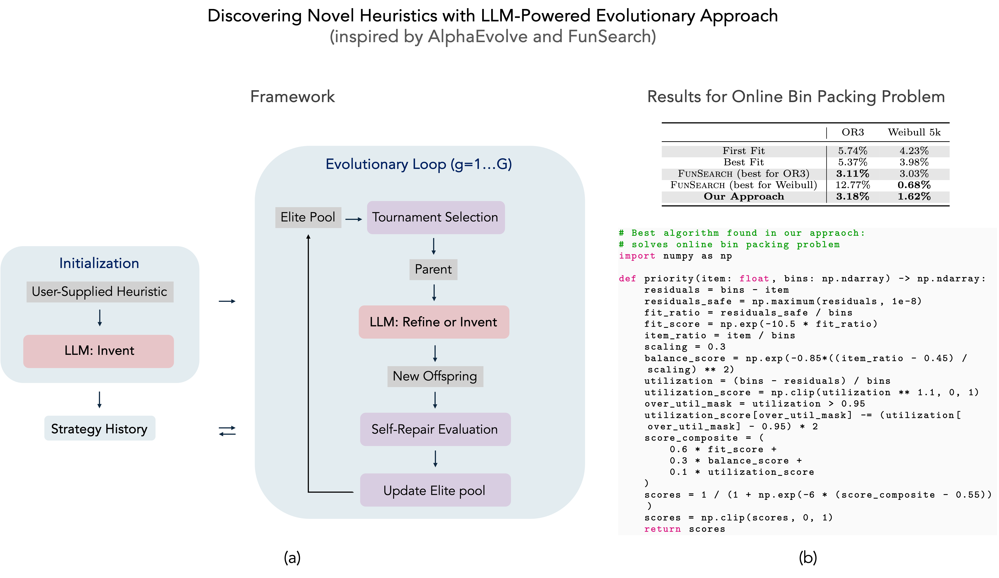

# A Minimal Reimplementation of AlphaEvolve for Heuristic Discovery 

  


A minimal and streamlined implementation of **AlphaEvolve** *([Novikov et al., 2025](https://arxiv.org/abs/2506.13131))* applied to one-dimensional online bin-packing. We Demonstrate how iterative invention and refinement using LLMs can yield heuristics that outperform classical methods.



## Overview

AlphaEvolve embeds LLM-guided heuristic generation into a population-based evolutionary loop. Key features:

**Population-based search**: Maintains a pool of candidate heuristics.

**Reinvention**: Uses an LLM to generate entirely new heuristics.

**Refinement**: Applies targeted, LLM-driven edits to existing heuristics.

**Tournament selection**: Propagates top performers across generations.

We apply this to the online one-dimensional bin packing problem, a classic NP-hard task in which items arrive sequentially and must be placed into bins of given capacity without relocation, minimizing the total number of bins used.

This toy implementation showcases the core invent/refine dynamics on standard bin-packing benchmarks such as OR3 and Weibull‑5k. By leveraging only modest computational resources (e.g., GPT-4.1-nano), it discovers a novel heuristic that closely matches the performance of the best heuristic identified in FunSearch (Romera-Paredes et al., 2024:
[paper](https://deepmind.google/discover/blog/funsearch-making-new-discoveries-in-mathematical-sciences-using-large-language-models/) and
[code](https://github.com/google-deepmind/funsearch)), while exhibiting stronger generalization to unseen datasets.

## Technical Report

For full technical details, including pseudocode and theoretical motivation, see this [document](technical_report.pdf).


## Installation


### Prerequisites
- Python 3.7+
- OpenAI API key (get one at https://platform.openai.com/)
- Required packages: `pip install numpy openai`


1. Clone the repository:

   ```bash
   git clone https://github.com/yourusername/LLM-search-binpacking.git
   ```
2. Run the evolution:
   ```bash
   python run_binpack_clean.py
   ```
3. View the result in `evolved_heuristics_{timestamp}.txt`


## Configuration & Hyperparameters

Three core hyperparameters:

* **Population size** (`p`): number of elites maintained.
* **Generations** (`G`): evolutionary search horizon.
* **Tournament size** (`k`): selection pressure control.

Default toy-run values: `(p, G, k) = (14, 10, 4)` to stay within modest compute budgets.

You can customize the initial seed heuristics by editing `seeds/` or passing a JSON file to `--init_seeds`.

If the LLM returned function is not valid Python, the code asks the LLM to fix it up to three times (which can be easily adjusted). Otherwise a large penalty is applied to the fitness. 

---

## Experiments & Results

The `results/` directory contains:

* **Metrics** (`metrics.jsonl`): per-generation performance (e.g., average bins used).
* **Best Heuristics**: evolved Python functions in `results/best/`.

---

*Original code in this repository is licensed under the MIT License. Portions derived from DeepMind’s FunSearch are licensed under the Apache License 2.0*